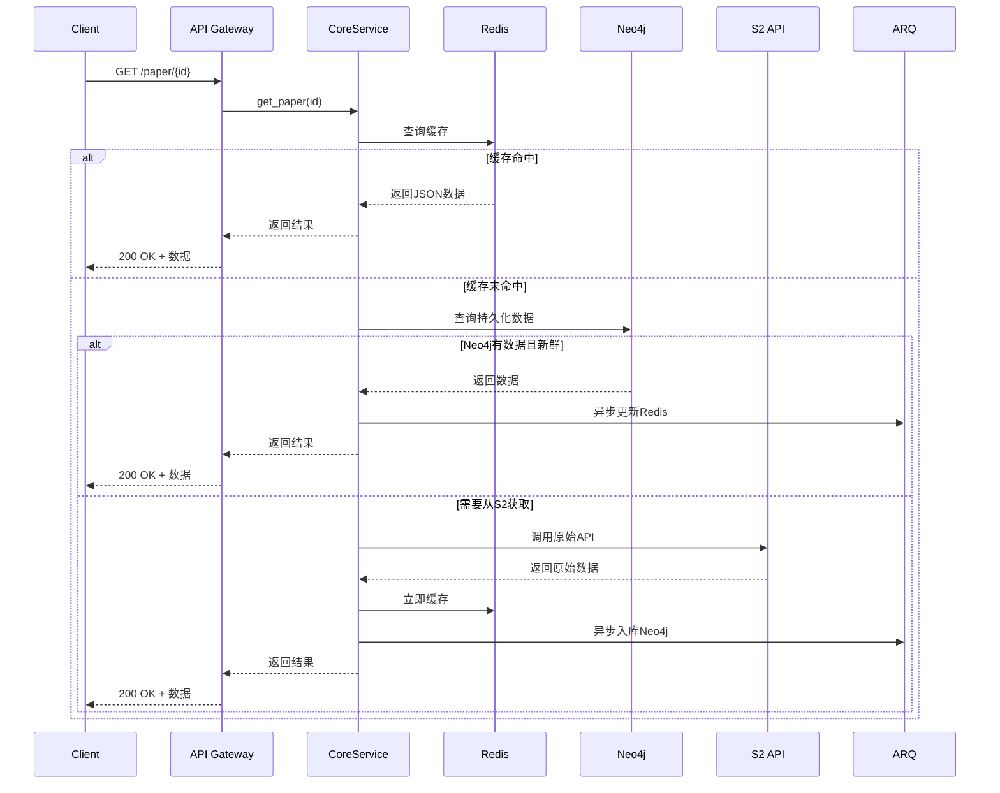
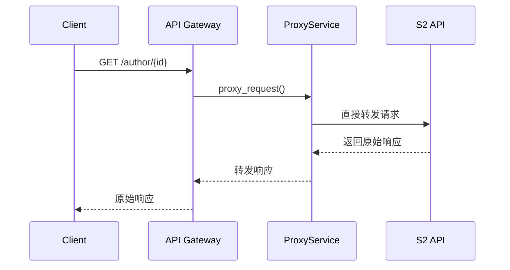

# Paper Parser 系统架构设计文档

## 📋 概述

Paper Parser 是一个基于 Semantic Scholar API 的学术论文缓存和代理服务，旨在提供快速、稳定的论文数据访问能力。系统采用"核心缓存 + 其他转发"的策略，对热门 API 进行深度优化，其他 API 直接代理转发。

### 🎯 设计目标

- **高性能**：三级缓存架构，毫秒级响应热门数据
- **高可用**：异步处理，不阻塞用户请求
- **易维护**：分层架构，职责清晰
- **渐进式**：核心功能先行，逐步扩展
- **完全兼容**：对外 API 完全兼容 Semantic Scholar

### 🏗️ 技术栈

- **API 层**：FastAPI + Uvicorn
- **缓存层**：Redis (热数据缓存 + 任务状态)
- **存储层**：Neo4j (结构化存储 + 关系查询)
- **任务队列**：ARQ + Redis
- **外部 API**：Semantic Scholar API
- **监控**：Prometheus + Grafana
- **日志**：Loguru + ELK Stack

## 🏛️ 系统架构

```
┌─────────────────────────────────────────────────────────┐
│                    1. API Gateway Layer                 │
│                   (FastAPI Router)                     │
│                                                         │
│  ┌─────────────────┬─────────────────┬─────────────────┐│
│  │  Core APIs      │  Proxy APIs     │  Health Check   ││
│  │  (缓存+解析)    │  (直接转发)     │                 ││
│  │                 │                 │                 ││
│  │ /paper/{id}     │ /author/{id}    │ /health         ││
│  │ /paper/search   │ /paper/bulk     │ /metrics        ││
│  │ /paper/batch    │ /autocomplete   │                 ││
│  └─────────────────┴─────────────────┴─────────────────┘│
├─────────────────────────────────────────────────────────┤
│                  2. Service Layer                      │
│                                                         │
│  ┌─────────────────┬─────────────────┬─────────────────┐│
│  │ CorePaperService│  ProxyService   │  TaskService    ││
│  │                 │                 │                 ││
│  │ - 三级缓存逻辑  │ - S2 API转发    │ - 异步任务管理  ││
│  │ - 数据解析入库  │ - 请求/响应包装 │ - 状态追踪      ││
│  │ - 状态管理      │ - 错误处理      │                 ││
│  └─────────────────┴─────────────────┴─────────────────┘│
├─────────────────────────────────────────────────────────┤
│                3. Data Access Layer                    │
│                                                         │
│  ┌─────────────────┬─────────────────┬─────────────────┐│
│  │   RedisClient   │   Neo4jClient   │   S2Client      ││
│  │                 │                 │                 ││
│  │ - JSON缓存      │ - 结构化存储    │ - HTTP客户端    ││
│  │ - 任务状态      │ - 关系查询      │ - 限流重试      ││
│  │ - 会话管理      │ - 批量操作      │ - 错误处理      ││
│  └─────────────────┴─────────────────┴─────────────────┘│
├─────────────────────────────────────────────────────────┤
│               4. Background Task Layer                 │
│                  (ARQ Workers)                         │
│                                                         │
│  ┌─────────────────┬─────────────────┬─────────────────┐│
│  │ DataIngestion   │ CacheManagement │ SystemMaintain  ││
│  │                 │                 │                 ││
│  │ - 解析S2数据    │ - 缓存预热      │ - 清理过期数据  ││
│  │ - 入库Neo4j     │ - 缓存更新      │ - 健康检查      ││
│  │ - 状态更新      │ - 失效处理      │ - 日志归档      ││
│  └─────────────────┴─────────────────┴─────────────────┘│
└─────────────────────────────────────────────────────────┘
```

## 🔄 数据流设计

### 核心 API 数据流



### 代理 API 数据流



## 📊 数据模型设计

### Redis 存储结构

```python
# 热数据缓存 (TTL: 1小时)
paper:paperId:full → 完整JSON数据
paper:paperId:basic → 基础信息JSON  
paper:doi:10.xxx → paperId映射
paper:arxiv:1234.5678 → paperId映射

# 任务状态缓存 (TTL: 10分钟)  
task:paperId:status → {"status": "processing|completed|failed", "progress": 80}

# 搜索结果缓存 (TTL: 30分钟)
search:query_hash → {"results": [...], "total": 1000, "cached_at": "..."}

# 系统状态缓存
system:s2_api_status → {"available": true, "last_check": "...", "rate_limit": {...}}
```

### Neo4j 数据模型

```cypher
// 论文节点
CREATE (p:Paper {
  paperId: "string",           // S2主键
  corpusId: 123,               // S2次键  
  title: "string",             // 标题
  abstract: "string",          // 摘要
  year: 2023,                  // 年份
  citationCount: 100,          // 引用数
  referenceCount: 50,          // 参考文献数
  influentialCitationCount: 10,// 有影响力引用数
  venue: "string",             // 发表场所
  fieldsOfStudy: ["CS"],       // 研究领域
  isOpenAccess: true,          // 开放获取
  dataJson: "完整JSON字符串",   // 原始数据备份
  lastUpdated: datetime(),     // 最后更新时间
  source: "s2"                 // 数据源
})

// 外部ID映射
CREATE (e:ExternalId {
  type: "DOI|ArXiv|PubMed",    // ID类型
  value: "10.1234/example",    // ID值
  paperId: "s2_paper_id"       // 关联的S2 ID
})

// 作者节点 (简化版)
CREATE (a:Author {
  authorId: "string",
  name: "string",
  paperCount: 100,
  citationCount: 1000
})

// 关系定义
CREATE (p1:Paper)-[:CITES]->(p2:Paper)      // 引用关系
CREATE (p:Paper)-[:AUTHORED_BY]->(a:Author) // 作者关系
CREATE (p:Paper)-[:HAS_EXTERNAL_ID]->(e:ExternalId) // 外部ID关系
```

### 索引策略

```cypher
// 核心索引
CREATE INDEX paper_id FOR (p:Paper) ON (p.paperId)
CREATE INDEX corpus_id FOR (p:Paper) ON (p.corpusId)
CREATE INDEX paper_title FOR (p:Paper) ON (p.title)
CREATE INDEX paper_year FOR (p:Paper) ON (p.year)

// 外部ID索引  
CREATE INDEX external_doi FOR (e:ExternalId) ON (e.value) WHERE e.type = "DOI"
CREATE INDEX external_arxiv FOR (e:ExternalId) ON (e.value) WHERE e.type = "ArXiv"

// 作者索引
CREATE INDEX author_id FOR (a:Author) ON (a.authorId)
CREATE INDEX author_name FOR (a:Author) ON (a.name)

// 复合索引
CREATE INDEX paper_year_citations FOR (p:Paper) ON (p.year, p.citationCount)
```

## 🎯 API 分类策略

### 核心 APIs (完整缓存策略)

这些 API 实现三级缓存 + 异步处理：

```python
GET  /paper/{paper_id}                    # 文献详情 [最高优先级]
GET  /paper/{paper_id}/citations          # 引用文献 [高优先级]  
GET  /paper/{paper_id}/references         # 参考文献 [高优先级]
GET  /paper/search                        # 文献搜索 [高优先级]
POST /paper/batch                         # 批量查询 [中优先级]
```

### 代理 APIs (直接转发)

这些 API 直接代理到 S2，不做缓存：

```python
GET  /paper/{paper_id}/authors            # 作者信息
GET  /author/{author_id}                  # 作者详情
GET  /author/{author_id}/papers           # 作者论文
GET  /paper/search/match                  # 精确匹配
GET  /paper/search/bulk                   # 批量搜索
GET  /paper/autocomplete                  # 自动补全
# ... 其他所有S2 API
```


---
# 以下信息仅参考

## ⚙️ 核心服务设计

### 设计补充：Alias统一、DataChunk基类、渐进式入库

本节补充当前实现到目标模型的折中设计，确保低成本落地并可平滑演进。

#### 1) Alias（外部标识）统一策略

- 节点：`ExternalId:Alias { type, value }`
- 关系：统一采用 `(:Paper)-[:HAS_EXTERNAL_ID]->(:ExternalId)`，不新增重复语义的边类型（如 `HAS_ALIAS`）。
- type 范围：`DOI | ArXiv | CorpusId | URL | TITLE_NORM | MAG | ACL | PMID | PMCID`
- 归一化规范：
  - DOI：小写、去空白
  - ArXiv：去版本后缀（v1/v2）、统一前缀格式
  - URL：小写 host、去末尾`/`、去常见追踪参数（utm_*）
  - TITLE_NORM：小写、去标点/空白、全角半角统一
- 约束/索引：`(ExternalId.type, ExternalId.value)` 唯一；读取路径优先匹配精确的 ID（DOI/ArXiv/CorpusId/URL/MAG/ACL/PMID/PMCID），再尝试 TITLE_NORM。

补充：输入解析支持前缀形式 `TYPE:value`（如 `DOI:10.1145/...`、`ARXIV:2106.15928`、`PMCID:2323736`）。

这样可与现有实现兼容（已在用 `HAS_EXTERNAL_ID`），避免边类型膨胀；新增的 alias 类型只需扩展 `type` 值。

#### 2) 数据存储策略

**Metadata存储：**
- 直接存储在 `Paper` 节点属性中：`Paper.metadataJson`, `Paper.metadataUpdated`
- 避免小数据的额外节点和关系开销，简化查询

**DataChunk 用于大数据：**
- 节点：`DataChunk { paperId, chunkType, dataJson, lastUpdated }`
- 标签：
  - `:DataChunk:PaperCitations  (chunkType='citations')`
  - `:DataChunk:PaperReferences (chunkType='references')`
- 关系：
  - `(:Paper)-[:HAS_CITATIONS]->(:PaperCitations)`
  - `(:Paper)-[:HAS_REFERENCES]->(:PaperReferences)`
- 索引/约束：`(paperId, chunkType)` 唯一；`paperId` 索引。
- 读写：提供统一的合并/读取 helper，内部只对 `dataJson` 做整体读写，不拆字段，降低耦合与复杂度。

保留 `Paper.dataJson` 作为冗余备份以便快速返回；DataChunk 便于后续离线任务逐步把 JSON 转为结构化图。

#### 3) 渐进式 CITES 关系生成

- 在线小规模：当 `citationCount/referenceCount <= 阈值` 时，直接异步批量 `MERGE` 邻居论文与 `CITES` 边。
- 大规模离线：超阈值的 paper 仅写入 `DataChunk`，同时创建 `:DataChunk:IngestPlan:PaperCitationsPlan` 计划节点（`status='pending'`，`total/pageSize`），由后台任务（队列/调度）分页 `UNWIND` 合并，确保幂等（全用 `MERGE`）。
- 幂等与性能：
  - 采用批量参数 `UNWIND`，避免单条往返；
  - 邻居 `Paper` 至少 `MERGE (p:Paper {paperId}) ON CREATE SET p.title=...`；
  - 失败重试与断点可通过队列重入与基于 `(paperId, chunkType, lastUpdated)` 的对比实现。

#### 4) Ingest 状态标记与节点合并

- 在 `Paper` 节点上增加 `ingestStatus`：`"stub" | "full"`。
  - stub：仅通过引用/被引邻居快速创建（只含 paperId/title）
  - full：已通过 API 拉取过主体，`Paper.dataJson`/`Paper.metadataJson` 完整
- 合并策略：统一使用 `MERGE (p:Paper {paperId})` 作为唯一主键，不做 title 合并； TITLE_NORM 仅用于 alias 命中，不做自动同名合并，避免歧义。

#### 5) 接入点与职责边界

- 接口层（CorePaperService）：
  - 获取数据后：写 Redis、调用 `neo4j.merge_paper(full_data)`；
  - 同步/异步触发：`merge_aliases_from_paper`、`merge_data_chunks`；
  - 判断阈值，小规模触发 `merge_cites_from_chunks`，大规模投递后台。
- Neo4j 客户端层：
  - 封装 `merge_aliases_from_paper`（含归一化）
  - 封装 `merge_data_chunks(paperId, ...)`（三类 chunk）
  - 封装 `merge_cites_from_refs/citations(paperId, refs)`（批量 UNWIND）
  - 索引/约束创建、健康检查、统计。

此设计保持与现有实现完全兼容，只增加：更多 alias 类型、DataChunk 节点、ingest 状态与批量 CITES 生成的能力。短期收益：更高缓存命中与可观测性；中期收益：可平滑演进到完整图结构。

### CorePaperService

```python
class CorePaperService:
    """核心论文服务 - 实现三级缓存策略"""
    
    def __init__(self, redis_client, neo4j_client, s2_client, task_queue):
        self.redis = redis_client
        self.neo4j = neo4j_client 
        self.s2 = s2_client
        self.tasks = task_queue
    
    async def get_paper(self, paper_id: str, fields: str = None) -> dict:
        """获取论文信息 - 三级缓存策略"""
        
        # 1. Redis缓存查询 (毫秒级)
        cache_key = f"paper:{paper_id}:{fields or 'full'}"
        cached = await self.redis.get(cache_key)
        if cached:
            return json.loads(cached)
            
        # 2. Neo4j持久化查询 (10ms级)  
        neo4j_data = await self.neo4j.get_paper(paper_id)
        if neo4j_data and self._is_data_fresh(neo4j_data):
            # 异步更新Redis
            asyncio.create_task(self._update_cache(cache_key, neo4j_data))
            return neo4j_data
            
        # 3. 检查处理状态
        task_status = await self.redis.get(f"task:{paper_id}:status")
        if task_status == "processing":
            # 等待最多3秒
            for i in range(6):
                await asyncio.sleep(0.5)
                cached = await self.redis.get(cache_key)
                if cached:
                    return json.loads(cached)
            # 超时处理
            raise HTTPException(408, "Request timeout, please try again")
        
        # 4. 调用S2 API (同步等待)
        await self.redis.set(f"task:{paper_id}:status", "processing", ex=300)
        try:
            s2_data = await self.s2.get_paper(paper_id, fields)
            
            # 立即缓存并返回
            await self.redis.setex(cache_key, 3600, json.dumps(s2_data))
            
            # 异步入库Neo4j
            self.tasks.ingest_paper_data.delay(s2_data)
            
            await self.redis.delete(f"task:{paper_id}:status")
            return s2_data
            
        except Exception as e:
            await self.redis.set(f"task:{paper_id}:status", "failed", ex=60)
            raise HTTPException(500, f"Failed to fetch paper: {str(e)}")
    
    def _is_data_fresh(self, data: dict, max_age_hours: int = 24) -> bool:
        """检查数据是否新鲜"""
        last_updated = data.get('lastUpdated')
        if not last_updated:
            return False
        age = datetime.now() - datetime.fromisoformat(last_updated)
        return age.total_seconds() < max_age_hours * 3600
```

### ProxyService

```python
class ProxyService:
    """代理服务 - 直接转发S2 API"""
    
    def __init__(self, s2_client):
        self.s2 = s2_client
    
    async def proxy_request(self, method: str, path: str, **kwargs) -> dict:
        """直接代理请求到S2"""
        try:
            response = await self.s2.request(method, path, **kwargs)
            return response
        except Exception as e:
            # 统一错误处理
            raise HTTPException(
                status_code=getattr(e, 'status_code', 500),
                detail=f"Upstream API error: {str(e)}"
            )
```

## 🔧 异步任务设计

### 任务分类和优先级

```python
# ARQ 异步任务定义
async def fetch_and_process_paper(paper_id: str, fields: Optional[str] = None):
    """完整的论文数据获取和处理流程 - 这是耗时操作"""
    # 1. 从 S2 API 获取数据（慢操作：网络请求）
    s2_data = await s2_client.get_paper(paper_id, fields)
    
    # 2. 解析并存储到 Neo4j（快操作：本地数据库）
    paper_node = parse_s2_paper(s2_data)
    await neo4j_client.merge_paper(paper_node)
    
    # 3. 更新 Redis 缓存（快操作：本地缓存）
    cache_key = f"paper:{paper_id}:full"
    await redis_client.setex(cache_key, 3600, json.dumps(s2_data))
    
    return s2_data  
def sync_citation_counts():
    """同步引用数更新 - 数据一致性"""
    # 定期更新动态统计数据
    pass
```

### 使用示例

```python
# API 端点中的异步调用
from arq import create_pool

@app.get("/paper/{paper_id}")
async def get_paper(paper_id: str):
    # 1. 先检查缓存
    cached = await redis_client.get(f"paper:{paper_id}:full")
    if cached:
        return json.loads(cached)
    
    # 2. 缓存未命中，启动异步任务
    redis_pool = await create_pool()
    job = await redis_pool.enqueue_job(
        'fetch_and_process_paper', 
        paper_id
    )
    
    # 3. 返回任务ID，让客户端轮询结果
    return {"task_id": job.job_id, "status": "processing"}

@app.get("/task/{task_id}")
async def get_task_result(task_id: str):
    # 客户端轮询任务结果
    redis_pool = await create_pool()
    job = await redis_pool.get_job(task_id)
    
    if job.status == 'complete':
        return {"status": "complete", "data": job.result}
    else:
        return {"status": "processing"}
```

### Worker 配置

```python
# worker.py - ARQ Worker 配置

class WorkerSettings:
    """ARQ Worker 配置"""
    
    functions = [
        # 核心任务函数 - 处理耗时的S2 API调用
        fetch_and_process_paper,
    ]
    
    redis_settings = RedisSettings(
        host='localhost',
        port=6379,
        database=0
    )
    
    # Worker 配置
    max_jobs = 10        # 最多10个并发任务
    job_timeout = 300    # 任务超时5分钟
    keep_result = 3600   # 结果保留1小时
```

## 📈 性能指标

### 响应时间目标

```
缓存命中 (Redis):     < 10ms
持久化命中 (Neo4j):   < 50ms  
S2 API调用:           < 3000ms
批量查询 (10篇):      < 500ms
搜索查询:             < 200ms
```

### 缓存命中率目标

```
热门论文 (Top 1000):   > 95%
一般论文:              > 70%
搜索结果:              > 60%
批量查询:              > 80%
```

### 系统容量规划

```
Redis 内存:           8GB (约100万篇论文缓存)
Neo4j 存储:          100GB (约1000万篇论文)
ARQ 工作进程:         1个 (最多10个并发任务)
并发连接数:          1000个
QPS 目标:            500 req/s
```

## 🛡️ 错误处理策略

### 分级降级机制

```python
# Level 1: Redis不可用
if redis_unavailable:
    # 直接查询Neo4j，跳过缓存
    return await neo4j_client.get_paper(paper_id)

# Level 2: Neo4j不可用  
if neo4j_unavailable:
    # 直接调用S2 API，不入库
    return await s2_client.get_paper(paper_id)

# Level 3: S2 API不可用
if s2_api_unavailable:
    # 返回Neo4j历史数据 + 警告
    data = await neo4j_client.get_paper(paper_id)
    if data:
        data['_warning'] = 'Data may be outdated due to upstream API issues'
        return data
    else:
        raise HTTPException(503, "Service temporarily unavailable")
```

### 限流和重试策略

```python
# S2 API限流配置
S2_RATE_LIMITS = {
    'requests_per_second': 100,
    'requests_per_hour': 10000,
    'concurrent_requests': 10
}

# 重试策略
RETRY_CONFIG = {
    'max_attempts': 3,
    'backoff_factor': 2,
    'retry_status_codes': [429, 502, 503, 504],
    'timeout_seconds': 30
}
```

## 📊 监控和日志

### 关键指标监控

```python
# 业务指标
- API响应时间分布 (P50, P95, P99)
- 缓存命中率 (Redis, Neo4j)  
- S2 API调用成功率
- 任务队列积压情况
- 错误率和错误类型分布

# 系统指标  
- CPU、内存、磁盘使用率
- Redis连接数和内存使用
- Neo4j查询性能
- ARQ工作进程状态
- 网络延迟和带宽使用

# 告警规则
- API错误率 > 5%
- 响应时间P95 > 1000ms  
- 缓存命中率 < 60%
- 任务队列积压 > 1000
- 系统资源使用率 > 80%
```

### 日志策略

```python
# 日志级别和内容
INFO:  正常业务流程 (API调用、缓存命中等)
WARN:  异常但可恢复 (缓存未命中、重试等)  
ERROR: 错误需要关注 (API失败、数据库错误等)
DEBUG: 详细调试信息 (仅开发环境)

# 日志格式
{
    "timestamp": "2024-01-01T12:00:00Z",
    "level": "INFO", 
    "service": "core_paper_service",
    "operation": "get_paper",
    "paper_id": "123456",
    "cache_hit": true,
    "response_time_ms": 15,
    "trace_id": "abc-def-123"
}
```

## 🚀 部署架构

### 生产环境部署

```yaml
# docker-compose.yml
version: '3.8'
services:
  api-gateway:
    image: paper-parser:latest
    ports: ["8000:8000"]
    replicas: 3
    
  redis:
    image: redis:7-alpine
    ports: ["6379:6379"]
    volumes: ["redis_data:/data"]
    
  neo4j:
    image: neo4j:5
    ports: ["7687:7687", "7474:7474"] 
    volumes: ["neo4j_data:/data"]
    
  arq-worker:
    image: paper-parser:latest
    command: arq app.tasks.worker.WorkerSettings
```

## 📅 开发计划

### Phase 1: 基础架构 (Week 1)
- [ ] 环境搭建 (FastAPI + Redis + Neo4j)
- [ ] S2Client HTTP客户端实现
- [ ] ProxyService 直接转发功能
- [ ] 基础 `GET /paper/{id}` 缓存逻辑
- [ ] 基础监控和日志

### Phase 2: 核心功能 (Week 2)  
- [ ] Citations/References 缓存实现
- [ ] 搜索功能缓存
- [ ] 批量查询接口
- [ ] ARQ 异步任务系统
- [ ] 错误处理和降级机制

### Phase 3: 优化完善 (Week 3)
- [ ] 性能调优和压力测试
- [ ] 缓存策略优化
- [ ] 完整监控体系
- [ ] 文档和部署脚本
- [ ] 生产环境部署

### Phase 4: 扩展功能 (Week 4+)
- [ ] 更多 API 的缓存支持
- [ ] 智能预热策略
- [ ] 数据分析和报告
- [ ] 管理后台界面

## 🔧 配置管理

### 环境变量配置

```python
# config/settings.py
from pydantic import BaseSettings

class Settings(BaseSettings):
    # API配置
    API_HOST: str = "0.0.0.0"
    API_PORT: int = 8000
    API_PREFIX: str = "/api/v1"
    
    # S2 API配置
    S2_API_KEY: str = ""
    S2_BASE_URL: str = "https://api.semanticscholar.org/graph/v1"
    S2_RATE_LIMIT: int = 100  # requests per second
    
    # Redis配置
    REDIS_URL: str = "redis://localhost:6379/0"
    REDIS_MAX_CONNECTIONS: int = 20
    REDIS_DEFAULT_TTL: int = 3600  # 1小时
    
    # Neo4j配置  
    NEO4J_URI: str = "bolt://localhost:7687"
    NEO4J_USER: str = "neo4j"
    NEO4J_PASSWORD: str = "password"
    
    
    # 监控配置
    ENABLE_METRICS: bool = True
    LOG_LEVEL: str = "INFO"
    
    class Config:
        env_file = ".env"
```

## 📚 API 文档

### 核心 API 接口

详细的 API 文档将通过 FastAPI 自动生成，访问 `/docs` 查看 Swagger UI。

主要接口包括：
- 文献查询：`GET /paper/{paper_id}`
- 引用查询：`GET /paper/{paper_id}/citations`  
- 参考文献：`GET /paper/{paper_id}/references`
- 文献搜索：`GET /paper/search`
- 批量查询：`POST /paper/batch`
- 健康检查：`GET /health`
- 系统指标：`GET /metrics`

---

## 📝 总结

这个架构设计基于"渐进式优化"的理念：

1. **先做核心**：优先实现最重要的文献查询功能
2. **后做边缘**：其他功能直接代理，降低复杂度  
3. **数据驱动**：基于实际使用情况决定后续优化方向
4. **可扩展性**：分层架构便于后续功能扩展

通过这个设计，我们可以快速上线一个可用的系统，然后根据用户反馈和使用数据逐步优化和扩展功能。

---

*文档版本：v1.0*  
*最后更新：2024-01-01*  
*维护者：Paper Parser Team*
