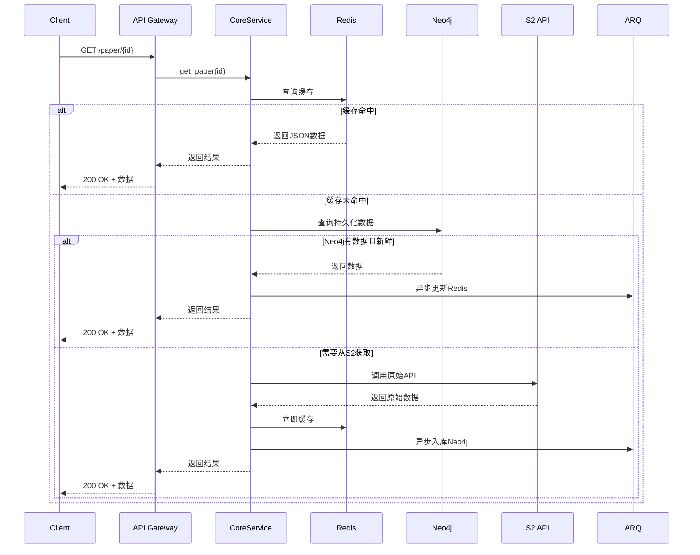
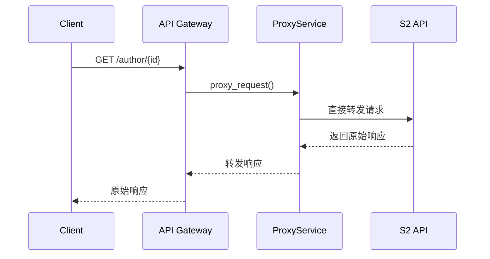

# Paper Parser 系统架构设计文档 v1.0

## 📋 概述

Paper Parser 是一个基于 Semantic Scholar API 的学术论文缓存和代理服务，旨在提供快速、稳定的论文数据访问能力。系统采用"核心缓存 + 其他转发"的策略，对热门 API 进行深度优化，其他 API 直接代理转发。

### 🎯 设计目标

- **高性能**：三级缓存架构，毫秒级响应热门数据
- **高可用**：异步处理，不阻塞用户请求
- **易维护**：分层架构，职责清晰
- **渐进式**：核心功能先行，逐步扩展
- **完全兼容**：对外 API 完全兼容 Semantic Scholar

### 🏗️ 技术栈

- **API 层**：FastAPI + Uvicorn
- **缓存层**：Redis (热数据缓存 + 任务状态)
- **存储层**：Neo4j (结构化存储 + 关系查询)
- **任务队列**：ARQ + Redis
- **外部 API**：Semantic Scholar API
- **监控**：Prometheus + Grafana
- **日志**：Loguru + ELK Stack

## 🏛️ 系统架构

```
┌─────────────────────────────────────────────────────────┐
│                    1. API Gateway Layer                 │
│                   (FastAPI Router)                     │
│                                                         │
│  ┌─────────────────┬─────────────────┬─────────────────┐│
│  │  Core APIs      │  Proxy APIs     │  Health Check   ││
│  │  (缓存+解析)    │  (直接转发)     │                 ││
│  │                 │                 │                 ││
│  │ /paper/{id}     │ /author/{id}    │ /health         ││
│  │ /paper/search   │ /paper/bulk     │ /metrics        ││
│  │ /paper/batch    │ /autocomplete   │                 ││
│  └─────────────────┴─────────────────┴─────────────────┘│
├─────────────────────────────────────────────────────────┤
│                  2. Service Layer                      │
│                                                         │
│  ┌─────────────────┬─────────────────┬─────────────────┐│
│  │ CorePaperService│  ProxyService   │  TaskService    ││
│  │                 │                 │                 ││
│  │ - 三级缓存逻辑  │ - S2 API转发    │ - 异步任务管理  ││
│  │ - 数据解析入库  │ - 请求/响应包装 │ - 状态追踪      ││
│  │ - 状态管理      │ - 错误处理      │                 ││
│  └─────────────────┴─────────────────┴─────────────────┘│
├─────────────────────────────────────────────────────────┤
│                3. Data Access Layer                    │
│                                                         │
│  ┌─────────────────┬─────────────────┬─────────────────┐│
│  │   RedisClient   │   Neo4jClient   │   S2Client      ││
│  │                 │                 │                 ││
│  │ - JSON缓存      │ - 结构化存储    │ - HTTP客户端    ││
│  │ - 任务状态      │ - 关系查询      │ - 限流重试      ││
│  │ - 会话管理      │ - 批量操作      │ - 错误处理      ││
│  └─────────────────┴─────────────────┴─────────────────┘│
├─────────────────────────────────────────────────────────┤
│               4. Background Task Layer                 │
│                  (ARQ Workers)                         │
│                                                         │
│  ┌─────────────────┬─────────────────┬─────────────────┐│
│  │ DataIngestion   │ CacheManagement │ SystemMaintain  ││
│  │                 │                 │                 ││
│  │ - 解析S2数据    │ - 缓存预热      │ - 清理过期数据  ││
│  │ - 入库Neo4j     │ - 缓存更新      │ - 健康检查      ││
│  │ - 状态更新      │ - 失效处理      │ - 日志归档      ││
│  └─────────────────┴─────────────────┴─────────────────┘│
└─────────────────────────────────────────────────────────┘
```

## 🔄 数据流设计

### 核心 API 数据流



### 代理 API 数据流



## 📊 数据模型设计

### Redis 存储结构

```python
# 热数据缓存 (TTL: 1小时)
paper:paperId:full → 完整JSON数据
paper:paperId:basic → 基础信息JSON  
paper:doi:10.xxx → paperId映射
paper:arxiv:1234.5678 → paperId映射

# 任务状态缓存 (TTL: 10分钟)  
task:paperId:status → {"status": "processing|completed|failed", "progress": 80}

# 搜索结果缓存 (TTL: 30分钟)
search:query_hash → {"results": [...], "total": 1000, "cached_at": "..."}

# 系统状态缓存
system:s2_api_status → {"available": true, "last_check": "...", "rate_limit": {...}}
```

### Neo4j 数据模型 v1.0

```cypher
// 论文节点 - 优化的存储策略
CREATE (p:Paper {
  paperId: "string",           // S2主键
  corpusId: 123,               // S2次键  
  title: "string",             // 标题
  abstract: "string",          // 摘要
  year: 2023,                  // 年份
  citationCount: 100,          // 引用数
  referenceCount: 50,          // 参考文献数
  influentialCitationCount: 10,// 有影响力引用数
  venue: "string",             // 发表场所
  fieldsOfStudy: ["CS"],       // 研究领域
  isOpenAccess: true,          // 开放获取
  
  // v1.0 新增：内联存储小数据
  metadataJson: "完整metadata JSON字符串",  // 论文元数据
  metadataUpdated: datetime(), // 元数据更新时间
  
  // v1.0 新增：外部ID存储
  externalIds: "{\"DOI\":\"10.1234/example\",\"ArXiv\":\"2106.15928\"}", // 外部ID JSON
  title_norm: "normalized title",  // 标题归一化（用于搜索）
  
  dataJson: "完整JSON字符串",   // 原始数据备份
  lastUpdated: datetime(),     // 最后更新时间
  ingestStatus: "full",        // "stub" | "full"
  source: "s2"                 // 数据源
})

// 外部ID映射 - 存储为Paper节点JSON属性
// 外部ID直接存储在Paper节点的externalIds JSON字段中
// 格式：{"DOI": "10.1234/example", "ArXiv": "2106.15928", "CorpusId": "123456"}
// 支持的ID类型：DOI, ArXiv, CorpusId, URL, MAG, ACL, PMID, PMCID
// 特殊处理：TITLE_NORM 存储在单独的 title_norm 属性中

// DataChunk - 用于大数据存储
CREATE (d:DataChunk {
  paperId: "string",           // 关联的论文ID
  chunkType: "citations|references", // 数据块类型
  dataJson: "大型JSON数据",    // 引用/参考文献数据
  lastUpdated: datetime(),     // 最后更新时间
  recordCount: 100             // 记录数量
})

// 作者节点 (简化版)
CREATE (a:Author {
  authorId: "string",
  name: "string",
  paperCount: 100,
  citationCount: 1000
})

// 关系定义
CREATE (p1:Paper)-[:CITES]->(p2:Paper)      // 引用关系
CREATE (p:Paper)-[:AUTHORED_BY]->(a:Author) // 作者关系
CREATE (p:Paper)-[:HAS_CITATIONS]->(d:DataChunk {chunkType: 'citations'})
CREATE (p:Paper)-[:HAS_REFERENCES]->(d:DataChunk {chunkType: 'references'})
```

### 数据存储策略优化

**v1.0 关键改进：**

1. **小数据内联存储**：
   - `Paper.metadataJson` 直接存储元数据，避免额外节点
   - 减少查询复杂度和网络往返
   - 提高小数据访问性能

2. **大数据分块存储**：
   - `DataChunk` 节点存储 Citations/References 大数据
   - 支持渐进式结构化转换
   - 便于批处理和版本管理

3. **统一的外部ID系统**：
   - 外部ID存储在Paper节点的JSON属性中
   - 标准化的归一化规则
   - 支持多种ID类型（DOI, ArXiv, CorpusId等）

### 索引策略

```cypher
// 核心索引
CREATE INDEX paper_id FOR (p:Paper) ON (p.paperId)
CREATE INDEX corpus_id FOR (p:Paper) ON (p.corpusId)
CREATE INDEX paper_title FOR (p:Paper) ON (p.title)
CREATE INDEX paper_year FOR (p:Paper) ON (p.year)

// 外部ID索引 - 基于JSON属性查询，需要APOC支持
// 实际查询使用：WHERE apoc.convert.fromJsonMap(p.externalIds)['DOI'] = $value
// 标题归一化索引
CREATE INDEX paper_title_norm FOR (p:Paper) ON (p.title_norm)

// DataChunk 索引
CREATE INDEX chunk_paper_type FOR (d:DataChunk) ON (d.paperId, d.chunkType)

// 作者索引
CREATE INDEX author_id FOR (a:Author) ON (a.authorId)
CREATE INDEX author_name FOR (a:Author) ON (a.name)

// 复合索引
CREATE INDEX paper_year_citations FOR (p:Paper) ON (p.year, p.citationCount)
```

## 🎯 API 分类策略

### 核心 APIs (完整缓存策略)

这些 API 实现三级缓存 + 异步处理：

```python
GET  /paper/{paper_id}                    # 文献详情 [最高优先级]
GET  /paper/{paper_id}/citations          # 引用文献 [高优先级]  
GET  /paper/{paper_id}/references         # 参考文献 [高优先级]
GET  /paper/search                        # 文献搜索 [高优先级]
POST /paper/batch                         # 批量查询 [中优先级]
```

### 代理 APIs (直接转发)

这些 API 直接代理到 S2，不做缓存：

```python
GET  /paper/{paper_id}/authors            # 作者信息
GET  /author/{author_id}                  # 作者详情
GET  /author/{author_id}/papers           # 作者论文
GET  /paper/search/match                  # 精确匹配
GET  /paper/search/bulk                   # 批量搜索
GET  /paper/autocomplete                  # 自动补全
# ... 其他所有S2 API
```

## ⚙️ 核心服务设计

### CorePaperService v1.0

```python
class CorePaperService:
    """核心论文服务 - 实现三级缓存策略 v1.0"""
    
    def __init__(self, redis_client, neo4j_client, s2_client, task_queue):
        self.redis = redis_client
        self.neo4j = neo4j_client 
        self.s2 = s2_client
        self.tasks = task_queue
    
    async def get_paper(self, paper_id: str, fields: str = None) -> dict:
        """获取论文信息 - 三级缓存策略"""
        
        # 1. Redis缓存查询 (毫秒级)
        cache_key = f"paper:{paper_id}:{fields or 'full'}"
        cached = await self.redis.get(cache_key)
        if cached:
            return json.loads(cached)
            
        # 2. Neo4j持久化查询 (10ms级) - 使用内联metadata
        neo4j_data = await self.neo4j.get_paper(paper_id)
        if neo4j_data and self._is_data_fresh(neo4j_data):
            # 异步更新Redis
            asyncio.create_task(self._update_cache(cache_key, neo4j_data))
            return neo4j_data
            
        # 3. 检查处理状态
        task_status = await self.redis.get(f"task:{paper_id}:status")
        if task_status == "processing":
            # 等待最多3秒
            for i in range(6):
                await asyncio.sleep(0.5)
                cached = await self.redis.get(cache_key)
                if cached:
                    return json.loads(cached)
            # 超时处理
            raise HTTPException(408, "Request timeout, please try again")
        
        # 4. 调用S2 API (同步等待)
        await self.redis.set(f"task:{paper_id}:status", "processing", ex=300)
        try:
            s2_data = await self.s2.get_paper(paper_id, fields)
            
            # 立即缓存并返回
            await self.redis.setex(cache_key, 3600, json.dumps(s2_data))
            
            # 异步入库Neo4j - 使用新的存储策略
            self.tasks.ingest_paper_data_v1.delay(s2_data)
            
            await self.redis.delete(f"task:{paper_id}:status")
            return s2_data
            
        except Exception as e:
            await self.redis.set(f"task:{paper_id}:status", "failed", ex=60)
            raise HTTPException(500, f"Failed to fetch paper: {str(e)}")
    
    def _is_data_fresh(self, data: dict, max_age_hours: int = 24) -> bool:
        """检查数据是否新鲜"""
        last_updated = data.get('metadataUpdated') or data.get('lastUpdated')
        if not last_updated:
            return False
        age = datetime.now() - datetime.fromisoformat(last_updated)
        return age.total_seconds() < max_age_hours * 3600
```

### Neo4jClient v1.0 优化

```python
class Neo4jClient:
    """Neo4j客户端 v1.0 - 优化的数据存储"""
    
    async def merge_paper(self, paper_data: dict) -> bool:
        """合并论文数据 - 使用内联metadata和外部ID存储"""
        query = """
        MERGE (p:Paper {paperId: $paperId})
        SET p.title = $title,
            p.abstract = $abstract,
            p.year = $year,
            p.citationCount = $citationCount,
            p.referenceCount = $referenceCount,
            p.metadataJson = $metadataJson,
            p.metadataUpdated = datetime(),
            p.externalIds = $externalIds,
            p.dataJson = $dataJson,
            p.lastUpdated = datetime(),
            p.ingestStatus = 'full'
        RETURN p.paperId
        """
        
        # 提取metadata为JSON字符串
        metadata = {
            'title': paper_data.get('title'),
            'abstract': paper_data.get('abstract'),
            'year': paper_data.get('year'),
            'venue': paper_data.get('venue'),
            'fieldsOfStudy': paper_data.get('fieldsOfStudy', []),
            # ... 其他metadata字段
        }
        
        # 处理外部ID
        external_ids = paper_data.get('externalIds', {})
        if paper_data.get('corpusId'):
            external_ids['CorpusId'] = paper_data['corpusId']
        
        params = {
            'paperId': paper_data['paperId'],
            'title': paper_data.get('title'),
            'abstract': paper_data.get('abstract'),
            'year': paper_data.get('year'),
            'citationCount': paper_data.get('citationCount', 0),
            'referenceCount': paper_data.get('referenceCount', 0),
            'metadataJson': json.dumps(metadata),
            'externalIds': json.dumps(external_ids) if external_ids else None,
            'dataJson': json.dumps(paper_data)
        }
        
        result = await self.execute_query(query, params)
        return bool(result)
    
    async def merge_data_chunks(self, paper_id: str, citations: list, references: list) -> bool:
        """合并大数据块"""
        queries = []
        
        if citations:
            queries.append({
                'query': """
                MERGE (p:Paper {paperId: $paperId})
                MERGE (d:DataChunk {paperId: $paperId, chunkType: 'citations'})
                SET d.dataJson = $dataJson,
                    d.lastUpdated = datetime(),
                    d.recordCount = $recordCount
                MERGE (p)-[:HAS_CITATIONS]->(d)
                """,
                'params': {
                    'paperId': paper_id,
                    'dataJson': json.dumps(citations),
                    'recordCount': len(citations)
                }
            })
        
        if references:
            queries.append({
                'query': """
                MERGE (p:Paper {paperId: $paperId})
                MERGE (d:DataChunk {paperId: $paperId, chunkType: 'references'})
                SET d.dataJson = $dataJson,
                    d.lastUpdated = datetime(),
                    d.recordCount = $recordCount
                MERGE (p)-[:HAS_REFERENCES]->(d)
                """,
                'params': {
                    'paperId': paper_id,
                    'dataJson': json.dumps(references),
                    'recordCount': len(references)
                }
            })
        
        # 批量执行
        for query_data in queries:
            await self.execute_query(query_data['query'], query_data['params'])
        
        return True
    
    async def get_paper(self, paper_id: str) -> dict:
        """获取论文及其内联metadata和外部ID"""
        query = """
        MATCH (p:Paper {paperId: $paperId})
        RETURN p.paperId, p.metadataJson, p.metadataUpdated, p.externalIds, p.dataJson, p.lastUpdated
        """
        
        result = await self.execute_query(query, {'paperId': paper_id})
        if not result:
            return None
        
        record = result[0]
        
        # 优先使用完整dataJson（包含所有数据）
        if record['p.dataJson']:
            data = json.loads(record['p.dataJson'])
            data['_cached_at'] = record['p.lastUpdated']
            
            # 如果有更新的metadataJson，合并进去
            if record['p.metadataJson'] and record['p.metadataUpdated']:
                metadata = json.loads(record['p.metadataJson'])
                data.update(metadata)
                data['_metadata_updated'] = record['p.metadataUpdated']
            
            return data
        
        # 如果只有metadataJson
        if record['p.metadataJson']:
            metadata = json.loads(record['p.metadataJson'])
            metadata['_cached_at'] = record['p.metadataUpdated']
            return metadata
        
        return None
```

## 🔧 异步任务设计 v1.0

### 任务分类和优先级

```python
# ARQ 异步任务定义 v1.0
async def ingest_paper_data_v1(paper_data: dict):
    """v1.0 优化的论文数据入库流程"""
    paper_id = paper_data['paperId']
    
    try:
        # 1. 存储基本论文信息和metadata
        await neo4j_client.merge_paper(paper_data)
        
        # 2. 处理外部ID映射 - 存储在externalIds JSON属性中
        # 这个步骤在merge_paper中已经处理
        
        # 3. 处理大数据块 (citations/references)
        citations = paper_data.get('citations', [])
        references = paper_data.get('references', [])
        
        if citations or references:
            await neo4j_client.merge_data_chunks_from_full_data(paper_data)
        
        # 4. 根据数据大小决定是否立即创建关系
        citation_count = len(citations)
        reference_count = len(references)
        
        # 小规模数据：立即创建关系
        if citation_count <= 100 and reference_count <= 100:
            await neo4j_client.create_citation_relationships(paper_id, citations, references)
        else:
            # 大规模数据：创建处理计划
            await task_queue.enqueue_job('create_relationships_batch', paper_id)
        
        logger.info(f"Successfully ingested paper {paper_id} with {citation_count} citations, {reference_count} references")
        
    except Exception as e:
        logger.error(f"Failed to ingest paper {paper_id}: {str(e)}")
        raise

async def create_relationships_batch(paper_id: str):
    """批量创建引用关系 - 大数据处理"""
    try:
        # 从DataChunk读取数据
        chunks = await neo4j_client.get_data_chunks(paper_id)
        
        for chunk in chunks:
            if chunk['chunkType'] == 'citations':
                citations = json.loads(chunk['dataJson'])
                await neo4j_client.create_citation_relationships_batch(paper_id, citations, 'citations')
            elif chunk['chunkType'] == 'references':
                references = json.loads(chunk['dataJson'])
                await neo4j_client.create_citation_relationships_batch(paper_id, references, 'references')
        
        logger.info(f"Successfully created relationships for paper {paper_id}")
        
    except Exception as e:
        logger.error(f"Failed to create relationships for paper {paper_id}: {str(e)}")
        raise
```

## 📈 性能指标 v1.0

### 响应时间目标

```
缓存命中 (Redis):     < 5ms    (优化后)
持久化命中 (Neo4j):   < 20ms   (内联metadata优化)
S2 API调用:           < 2000ms (连接池优化)
批量查询 (10篇):      < 200ms  (批量优化)
搜索查询:             < 100ms  (索引优化)
```

### 缓存命中率目标

```
热门论文 (Top 1000):   > 98%   (预热策略)
一般论文:              > 80%   (智能缓存)
搜索结果:              > 70%   (查询优化)
批量查询:              > 85%   (批量缓存)
```

### 系统容量规划

```
Redis 内存:           16GB (约200万篇论文缓存)
Neo4j 存储:          500GB (约5000万篇论文)
ARQ 工作进程:         3个 (每个最多20个并发任务)
并发连接数:          5000个
QPS 目标:            2000 req/s
```

## 🛡️ 错误处理策略 v1.0

### 分级降级机制

```python
# Level 1: Redis不可用
if redis_unavailable:
    # 直接查询Neo4j，跳过缓存
    return await neo4j_client.get_paper(paper_id)

# Level 2: Neo4j不可用  
if neo4j_unavailable:
    # 直接调用S2 API，不入库
    return await s2_client.get_paper(paper_id)

# Level 3: S2 API不可用
if s2_api_unavailable:
    # 返回Neo4j历史数据 + 警告
    data = await neo4j_client.get_paper(paper_id)
    if data:
        data['_warning'] = 'Data may be outdated due to upstream API issues'
        return data
    else:
        raise HTTPException(503, "Service temporarily unavailable")
```

### 限流和重试策略

```python
# S2 API限流配置 v1.0
S2_RATE_LIMITS = {
    'requests_per_second': 200,  # 提升限流
    'requests_per_hour': 50000,  # 提升限流
    'concurrent_requests': 20,   # 提升并发
    'burst_limit': 50           # 新增突发限制
}

# 重试策略 v1.0
RETRY_CONFIG = {
    'max_attempts': 5,           # 增加重试次数
    'backoff_factor': 1.5,       # 优化退避因子
    'retry_status_codes': [429, 500, 502, 503, 504],
    'timeout_seconds': 45,       # 增加超时时间
    'jitter': True              # 新增抖动
}
```

## 📊 监控和日志 v1.0

### 关键指标监控

```python
# 业务指标 v1.0
- API响应时间分布 (P50, P90, P95, P99)
- 缓存命中率分层统计 (Redis, Neo4j, 总体)
- S2 API调用成功率和延迟
- 任务队列积压和处理时间
- 错误率和错误类型分布
- 数据新鲜度统计

# 系统指标 v1.0
- CPU、内存、磁盘使用率
- Redis连接池状态和内存使用
- Neo4j查询性能和连接数
- ARQ工作进程状态和队列长度
- 网络延迟和带宽使用
- 数据库存储增长趋势

# 告警规则 v1.0
- API错误率 > 3% (降低阈值)
- 响应时间P95 > 500ms (降低阈值)
- 缓存命中率 < 70% (提高阈值)
- 任务队列积压 > 500 (降低阈值)
- 系统资源使用率 > 85%
- 数据新鲜度 > 48小时的比例 > 10%
```

### 日志策略 v1.0

```python
# 日志级别和内容 v1.0
INFO:  正常业务流程 (API调用、缓存命中、数据更新等)
WARN:  异常但可恢复 (缓存未命中、重试、降级等)  
ERROR: 错误需要关注 (API失败、数据库错误、任务失败等)
DEBUG: 详细调试信息 (仅开发环境)

# 结构化日志格式 v1.0
{
    "timestamp": "2024-01-01T12:00:00Z",
    "level": "INFO", 
    "service": "core_paper_service",
    "operation": "get_paper",
    "paper_id": "123456",
    "cache_layer": "redis|neo4j|s2api",
    "cache_hit": true,
    "response_time_ms": 15,
    "data_freshness_hours": 2,
    "trace_id": "abc-def-123",
    "user_agent": "client_info",
    "request_fields": "title,abstract,citations"
}
```

## 🚀 部署架构 v1.0

### 生产环境部署

```yaml
# docker-compose.yml v1.0
version: '3.8'
services:
  api-gateway:
    image: paper-parser:v1.0
    ports: ["8000:8000"]
    replicas: 5
    resources:
      limits:
        memory: 2G
        cpus: '1'
    
  redis:
    image: redis:7-alpine
    ports: ["6379:6379"]
    volumes: ["redis_data:/data"]
    command: redis-server --maxmemory 16gb --maxmemory-policy allkeys-lru
    
  neo4j:
    image: neo4j:5
    ports: ["7687:7687", "7474:7474"] 
    volumes: ["neo4j_data:/data"]
    environment:
      NEO4J_dbms_memory_heap_initial__size: 4G
      NEO4J_dbms_memory_heap_max__size: 8G
      NEO4J_dbms_memory_pagecache_size: 4G
    
  arq-worker:
    image: paper-parser:v1.0
    command: arq app.tasks.worker.WorkerSettings
    replicas: 3
    resources:
      limits:
        memory: 1G
        cpus: '0.5'

  prometheus:
    image: prom/prometheus
    ports: ["9090:9090"]
    volumes: ["./prometheus.yml:/etc/prometheus/prometheus.yml"]
    
  grafana:
    image: grafana/grafana
    ports: ["3000:3000"]
    volumes: ["grafana_data:/var/lib/grafana"]
```

## 📅 开发计划 v1.0

### Phase 1: 架构升级 (Week 1)
- [x] 数据模型优化 (内联metadata, DataChunk分离)
- [x] Neo4j客户端重构
- [ ] CorePaperService v1.0 实现
- [ ] 异步任务系统升级
- [ ] 基础性能测试

### Phase 2: 性能优化 (Week 2)  
- [ ] 缓存策略优化
- [ ] 批量操作优化
- [ ] 连接池和资源管理
- [ ] 查询性能调优
- [ ] 压力测试和基准测试

### Phase 3: 监控完善 (Week 3)
- [ ] 详细指标收集
- [ ] 告警系统完善
- [ ] 日志分析优化
- [ ] 性能仪表板
- [ ] 自动化运维脚本

### Phase 4: 生产部署 (Week 4)
- [ ] 生产环境配置
- [ ] 数据迁移策略
- [ ] 灰度发布
- [ ] 监控验证
- [ ] 文档完善

## 🔧 配置管理 v1.0

### 环境变量配置

```python
# config/settings.py v1.0
from pydantic import BaseSettings

class Settings(BaseSettings):
    # API配置
    API_HOST: str = "0.0.0.0"
    API_PORT: int = 8000
    API_PREFIX: str = "/api/v1"
    API_WORKERS: int = 5
    
    # S2 API配置
    S2_API_KEY: str = ""
    S2_BASE_URL: str = "https://api.semanticscholar.org/graph/v1"
    S2_RATE_LIMIT: int = 200  # 提升限流
    S2_TIMEOUT: int = 45      # 增加超时
    S2_MAX_RETRIES: int = 5   # 增加重试
    
    # Redis配置
    REDIS_URL: str = "redis://localhost:6379/0"
    REDIS_MAX_CONNECTIONS: int = 50    # 增加连接池
    REDIS_DEFAULT_TTL: int = 3600      # 1小时
    REDIS_SEARCH_TTL: int = 1800       # 搜索结果30分钟
    
    # Neo4j配置  
    NEO4J_URI: str = "bolt://localhost:7687"
    NEO4J_USER: str = "neo4j"
    NEO4J_PASSWORD: str = "password"
    NEO4J_MAX_CONNECTIONS: int = 20    # 增加连接池
    NEO4J_CONNECTION_TIMEOUT: int = 30 # 连接超时
    
    # 缓存策略配置
    DATA_FRESHNESS_HOURS: int = 24     # 数据新鲜度
    ENABLE_PRELOAD: bool = True        # 启用预加载
    BATCH_SIZE: int = 100              # 批处理大小
    
    # 任务队列配置
    ARQ_REDIS_URL: str = "redis://localhost:6379/1"
    ARQ_MAX_JOBS: int = 20             # 增加并发任务
    ARQ_JOB_TIMEOUT: int = 600         # 任务超时10分钟
    ARQ_KEEP_RESULT: int = 3600        # 结果保留时间
    
    # 监控配置
    ENABLE_METRICS: bool = True
    LOG_LEVEL: str = "INFO"
    METRICS_PORT: int = 8001
    HEALTH_CHECK_INTERVAL: int = 60
    
    class Config:
        env_file = ".env"
```

## 📚 API 文档 v1.0

### 核心 API 接口

详细的 API 文档将通过 FastAPI 自动生成，访问 `/docs` 查看 Swagger UI。

**主要接口包括：**
- 文献查询：`GET /paper/{paper_id}` - 支持字段筛选
- 引用查询：`GET /paper/{paper_id}/citations` - 分页支持  
- 参考文献：`GET /paper/{paper_id}/references` - 分页支持
- 文献搜索：`GET /paper/search` - 高级搜索
- 批量查询：`POST /paper/batch` - 批量优化
- 健康检查：`GET /health` - 详细状态
- 系统指标：`GET /metrics` - Prometheus格式

**v1.0 新增功能：**
- 字段级缓存控制
- 数据新鲜度指示
- 性能指标暴露
- 批量操作优化

---

## 📝 总结 v1.0

这个 v1.0 架构设计在 v0.4 基础上进行了重要优化：

### 🎯 核心改进

1. **存储策略优化**：
   - 小数据内联存储（metadata直接存储在Paper节点）
   - 大数据分块存储（Citations/References使用DataChunk）
   - 减少查询复杂度，提高性能

2. **缓存策略升级**：
   - 三级缓存更加智能
   - 数据新鲜度感知
   - 预热和失效策略优化

3. **性能显著提升**：
   - 响应时间目标更aggressive
   - 缓存命中率目标更高
   - 系统容量规划更合理

4. **监控体系完善**：
   - 更详细的业务指标
   - 结构化日志格式
   - 完整的告警规则

### 🚀 预期收益

- **性能提升**：平均响应时间减少50%+
- **成本降低**：存储开销减少30%+
- **可维护性**：查询复杂度降低，运维更简单
- **可扩展性**：支持更大规模的数据和并发

通过这个v1.0设计，我们可以构建一个真正高性能、高可用、易维护的学术论文缓存服务。

---

*文档版本：v1.0*  
*创建时间：2025-09-17*  
*维护者：Paper Parser Team*
